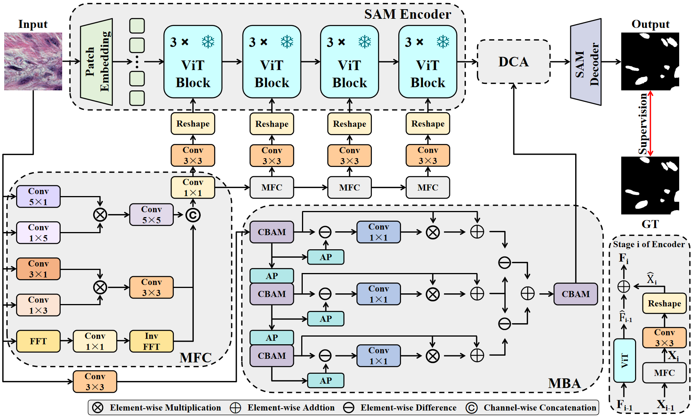

# MFB-SAC: A Multi-scale Frequency and Boundary-enhanced SAM for Cell Segmentation

[](https://2025.ieeeicip.org/)

## Introduction

This is the official implementation of our paper accepted by ICIP 2025. MFB-SAC is a cell segmentation model based on SAM, which enhances segmentation performance through multi-scale frequency and boundary enhancement.

### Authors
- Xutao Sun
- Xiaolu Xu
- Junwen Liu
- Yonggong Ren

School of Computer and Artificial Intelligence, Liaoning Normal University

## Network Architecture

<div align="center">
    
</div>

## Quick Start

### Installation
```bash
git clone https://github.com/Mrliujunwen/SAC.git
```


## Citation

If you find this work helpful, please consider citing our paper:

```bibtex
@inproceedings{sun2025mfbsac,
    title={MFB-SAC: A Multi-scale Frequency and Boundary-enhanced SAM for Cell Segmentation},
    author={Sun, Xutao and Xu, Xiaolu and Liu, Junwen and Ren, Yonggong},
    booktitle={2024 IEEE International Conference on Image Processing (ICIP)},
    year={2024}
}
```

## License

This project is under the MIT License. See the [LICENSE](LICENSE) file for details.


